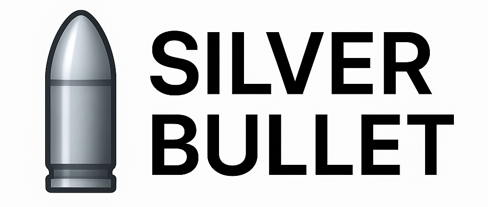

Silver Bullet
------

-----------------
Silver Bullet is an evaluation framework that takes inspiration from Reward models used in Reinforcement Learning, especially in RLHF.
The framework helps the user, based on the two texts to be compared, answer pertinent questions
1. Question and Answer pair: Can be used to confirm if the answer covers points about the question
2. Answer and Answer pair: Compare human preference for one of the answers
3. Context and Answer pair: Compare answer faithfulness

The final result is a score that depends upon pairs and use cases.
e.g: For answer and answer pair, the score can be interpreted that the answers are comparable or just slightly different, but one of the model is cheaper to use. This can effectively be used to choose models and compare performance.

-----------------

## Features
- **Lexical Analysis**: Measures surface-level similarity using word overlap and related metrics.
- **Semantic Analysis**: Uses transformer-based models to assess deeper meaning and context similarity.
- **NLI Analysis**: Evaluates logical relationships (entailment, contradiction, neutrality) between sentences.
- **Entity Counts**: Evaluates Entity counts between sentences to get soft idea for entity overlaps.
- **Sentence Splitting**: Breaks paragraphs into sentences for granular comparison.
- **Postprocessing**: Pads feature matrices for consistent output shapes.

-----------------

## Installation
1. Clone the repository.
2. Install dependencies:
   ```bash
   pip install -r requirements.txt
   ```

-----------------

## Usage
Run the main script to see a demonstration:
```bash
python example.py
```
This will compare two example paragraphs and print feature maps for lexical, semantic, and NLI similarity.

## Project Structure
- `main.py` — Entry point; demonstrates feature extraction and comparison.
- `requirements.txt` — Python dependencies.
- `Features/`
  - `Lexical/`
    - `getLexicalWeights.py` — Lexical feature extraction.
  - `Semantic/`
    - `getSemanticWeights.py` — Semantic feature extraction.
  - `NLI/`
    - `getNLIweights.py` — NLI feature extraction.
- `Splitter/`
  - `sentence_splitter.py` — Sentence splitting utility.
- `Postprocess/`
  - `_addpad.py` — Matrix padding utility.
- `Preprocess/` — (Reserved for preprocessing utilities, e.g., coreference resolution.)

## Extending
You can add new feature extraction methods by creating new modules in the `Features/` directory and integrating them in `main.py`.

## License
Specify your license here.

---
*For questions or contributions, please open an issue or pull request.*

