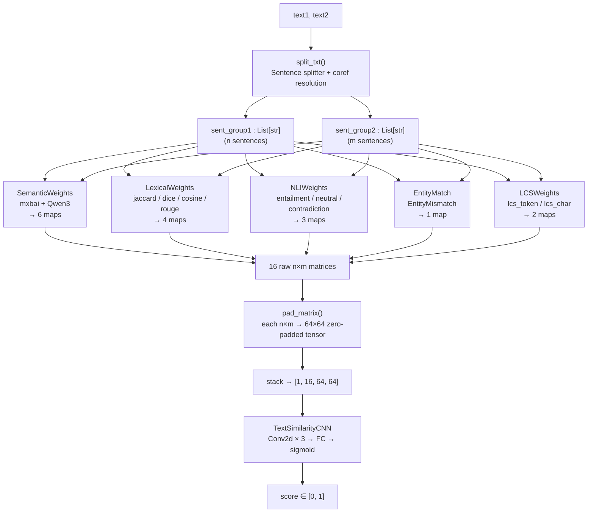
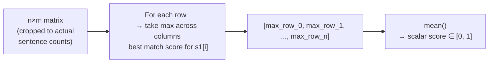
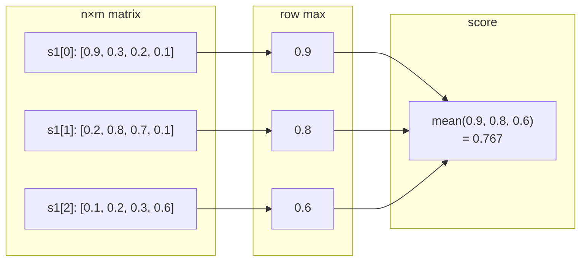
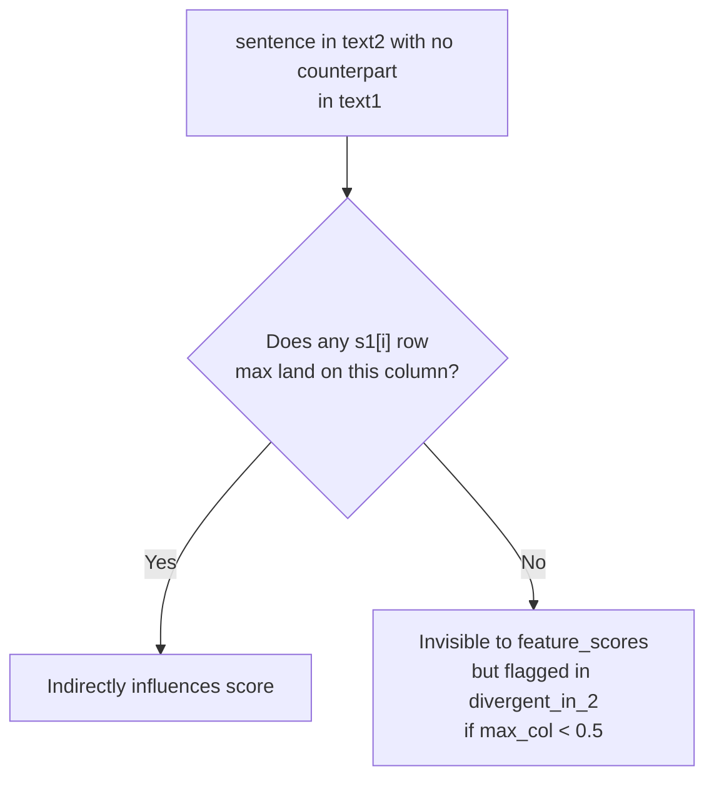
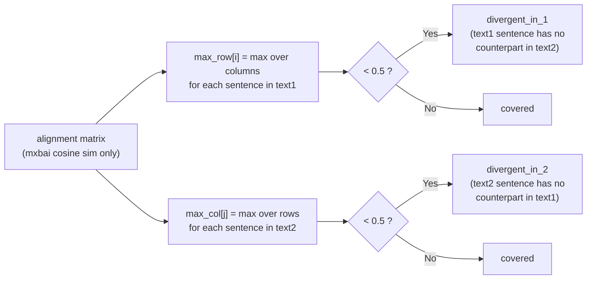
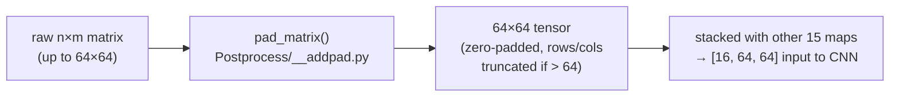

# SilverBullet — Score Computation

## Overview

Given two texts, the pipeline produces a scalar similarity score in [0, 1].
Each feature extractor builds an **n×m matrix** (n sentences from text1, m sentences from text2),
which is then reduced to a single score for display and fed into the CNN as a 64×64 padded tensor.

---

## Full Pipeline



---

## n×m Matrix Structure

Every feature extractor produces a matrix where cell `[i][j]` is the
similarity between sentence `i` from text1 and sentence `j` from text2.

```mermaid
block-beta
    columns 5
    A[""] B["s2[0]"] C["s2[1]"] D["s2[2]"] E["s2[3]"]
    F["s1[0]"] G["0.9"] H["0.3"] I["0.2"] J["0.1"]
    K["s1[1]"] L["0.2"] M["0.8"] N["0.7"] O["0.1"]
    P["s1[2]"] Q["0.1"] R["0.2"] S["0.3"] T["0.6"]
```

---

## Feature Score Reduction (mean-max-row)

For the breakdown panel, each n×m matrix is reduced to a single scalar
using `_mean_max_row` (`predict.py:141`):



### Example (3 sentences × 4 sentences)



**Interpretation:** *"On average, how well does each sentence in text1 find its best counterpart in text2?"*

---

## Asymmetry

The reduction is row-oriented (text1-centric). text2 sentences only influence the
score when they happen to be the best match for a text1 sentence.



This makes the score well-suited for **hallucination detection**
(`text1 = source context`, `text2 = LLM output`) where the primary concern is
whether every output sentence is grounded in the source — but it can
overestimate similarity when text2 adds fabricated sentences that still
partially match text1.

---

## Divergence Detection (separate from feature_scores)



> Divergence uses only the **mxbai cosine similarity** map, not all 16 maps.
> Threshold is hardcoded at `THRESH = 0.5` (`predict.py:131`).

---

## Feature Scores Displayed in the UI

| Label | Matrix key | Signal |
|---|---|---|
| Semantic (mxbai) | `mixedbread-ai/mxbai-embed-large-v1` | Dense cosine similarity |
| Semantic (Qwen3) | `Qwen/Qwen3-Embedding-0.6B` | Dense cosine similarity (2nd model) |
| Lexical ROUGE | `rouge` | ROUGE-1 F1 over SentencePiece tokens |
| Lexical Jaccard | `jaccard` | Jaccard index over token sets |
| NLI Entailment | `entailment` | roberta-large-mnli entailment probability |
| LCS Token | `lcs_token` | Normalised longest common subsequence |

The remaining 10 maps (`SOFT_ROW`, `SOFT_COL`, `dice`, `cosine`, `neutral`,
`contradiction`, `EntityMismatch`, `lcs_char`) are used by the CNN but not
displayed in the breakdown panel.

---

## Padding to 64×64



> Inputs exceeding 64 sentences are silently truncated (not crashed).
> See `Postprocess/__addpad.py`.
